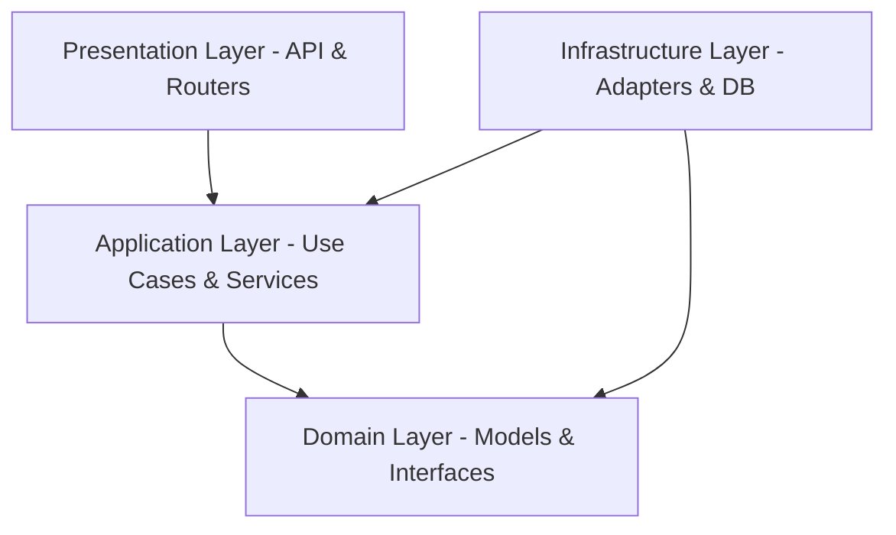

# Gazi Teknopark Kurumsal AI Asistanı - Proje Tanıtım ve Mimari Belgesi

Bu belge, **Gazi Teknopark Kurumsal AI Asistanı** projesinin tüm klasör yapısını, dizinler altındaki dosyaları, bu dosyaların üstlendiği rolleri ve projenin yazılım mimarisini (Clean Architecture & SOLID & DDD) detaylı bir şekilde açıklamak amacıyla hazırlanmıştır.

---

## 1. Genel Mimari Yaklaşım (Clean Architecture & DDD)

Projede iş kuralları (Business Logic) ile dış teknolojiler (Veritabanları, API kütüphaneleri, LLM'ler) birbirinden tamamen soyutlanmıştır. Mimarimiz iç içe geçmiş 4 temel katmandan oluşur:



1.  **Domain (Çekirdek) Katmanı:** Uygulamanın en iç katmanıdır. Dış dünyaya veya herhangi bir kütüphaneye bağımlılığı yoktur. Saf Python nesnelerinden (Entities) ve Repository arayüzlerinden (Abstract Interfaces) oluşur.
2.  **Application (Uygulama) Katmanı:** İş senaryolarının (Use Cases) koordine edildiği yerdir. API katmanından gelen istekleri alıp Domain modellerini ve Infrastructure servislerini kullanarak iş mantığını yürütür.
3.  **Infrastructure (Altyapı) Katmanı:** Dış servislerin (Qdrant, PostgreSQL, Redis, Ollama) entegre edildiği concrete (somut) sınıflardır.
4.  **Presentation (Sunum) Katmanı:** Kullanıcıyla etkileşime geçilen (FastAPI Routers, Schemas, React Frontend) katmandır.

---

## 2. Genel Klasör Yapısı

Aşağıda projenin kök dizininden itibaren genişletilmiş dosya yapısı yer almaktadır:

```text
gaziteknopark_ai/
├── backend/                  # FastAPI & Celery Tabanlı Backend Uygulaması
│   ├── app/
│   │   ├── core/             # Sistem Ayarları ve Güvenlik
│   │   ├── domain/           # Veri Modelleri ve Repository Arayüzleri
│   │   ├── application/      # İş Senaryoları (Use Cases) & Servis Arayüzleri
│   │   ├── infrastructure/   # DB Modelleri, Somut Servisler, Celery Tasks
│   │   ├── presentation/     # API Uç Noktaları (Endpoints) & Pydantic Şemaları
│   │   └── main.py           # Uygulama Başlangıç Noktası
│   ├── Dockerfile
│   └── requirements.txt
├── frontend/                 # React, Vite, TS & Mantine UI Tabanlı Arayüz
│   ├── src/
│   │   ├── core/             # API İletişim İstemcisi
│   │   ├── store/            # Global State Yönetimi (Zustand)
│   │   ├── features/         # Özellik Bazlı Sayfalar ve Bileşenler
│   │   ├── App.tsx
│   │   └── main.tsx
│   ├── index.html
│   └── vite.config.ts
├── nginx/                    # Reverse Proxy ve SSL Yapılandırması
└── docker-compose.yml        # Docker Konteyner Orkestrasyonu
```

---

## 3. Backend Detaylı Dosya Analizi

### A. Core Katmanı (`backend/app/core/`)
Sistem genelinde paylaşılan konfigürasyonları ve güvenlik ayarlarını barındırır.
-   [config.py](file:///Users/mustafakara/Documents/GitHub/gaziteknopark_ai/backend/app/core/config.py): Veritabanı URL'leri, JWT anahtarları, dosya yükleme limitleri (maks. 50MB) gibi ortam değişkenlerini (ENV) yükler ve yönetir.
-   [security.py](file:///Users/mustafakara/Documents/GitHub/gaziteknopark_ai/backend/app/core/security.py): Kullanıcı şifrelerinin hashlenmesi (bcrypt) ve JWT (JSON Web Token) üretilip doğrulanması işlemlerini gerçekleştirir.

### B. Domain Katmanı (`backend/app/domain/`)
Uygulamanın iş kurallarını tanımlayan saf Python modelleri ve arayüzleridir.
-   **Models (`domain/models/`):**
    -   [user.py](file:///Users/mustafakara/Documents/GitHub/gaziteknopark_ai/backend/app/domain/models/user.py): `User` (Kullanıcı) sınıfı ve `UserRole` (ADMIN, EDITOR, VIEWER) yetkilendirme tanımları.
    -   [document.py](file:///Users/mustafakara/Documents/GitHub/gaziteknopark_ai/backend/app/domain/models/document.py): `Document` (Belge) nesnesi ve işleme durumları (`PENDING`, `PROCESSING`, `COMPLETED`, `FAILED`).
    -   [collection.py](file:///Users/mustafakara/Documents/GitHub/gaziteknopark_ai/backend/app/domain/models/collection.py): Belgeleri gruplandırmaya yarayan `Collection` modeli.
    -   [chat.py](file:///Users/mustafakara/Documents/GitHub/gaziteknopark_ai/backend/app/domain/models/chat.py): `ChatSession` (Sohbet Oturumu) ve `ChatMessage` (Kullanılan kaynak referansları dahil her bir sohbet mesajı) yapıları.
    -   [audit.py](file:///Users/mustafakara/Documents/GitHub/gaziteknopark_ai/backend/app/domain/models/audit.py): Güvenlik ve takip için sistemde kimin hangi işlemi yaptığını kaydeden `AuditLog` modeli.
-   **Repositories (`domain/repositories/`):**
    -   Veritabanı teknolojisinden (SQLAlchemy, MongoDB vb.) bağımsız, veriye erişim şablonlarını belirleyen abstract sınıfları içerir (`IUserRepository`, `IDocumentRepository`, `IChatRepository` vb.).

### C. Application Katmanı (`backend/app/application/`)
İş mantığının koordinasyon merkezidir.
-   **Interfaces (`application/interfaces/`):**
    -   [llm.py](file:///Users/mustafakara/Documents/GitHub/gaziteknopark_ai/backend/app/application/interfaces/llm.py): Dil modeli (LLM) servisinin uyması gereken şablon (`ILLMService`).
    -   [embedding.py](file:///Users/mustafakara/Documents/GitHub/gaziteknopark_ai/backend/app/application/interfaces/embedding.py): Metinleri vektöre dönüştürecek embedding servis şablonu (`IEmbeddingService`).
-   **Services (`application/services/`):**
    -   [chat_workflow.py](file:///Users/mustafakara/Documents/GitHub/gaziteknopark_ai/backend/app/application/services/chat_workflow.py): **LangGraph** tabanlı sohbet akış motoru. Kullanıcının sorusunun niyetini sınıflandırır (`classify_node`), chit-chat (sohbet) ise doğrudan cevap üretir, RAG sorusu ise Qdrant'tan veri getirip BGE Reranker ile eler ve Ollama yerel modeline göndererek kaynak referanslı cevap üretir.
    -   [document_processor.py](file:///Users/mustafakara/Documents/GitHub/gaziteknopark_ai/backend/app/application/services/document_processor.py): Yüklenen PDF/DOCX dosyalarını işler. Tabloları ayıklar, metinleri anlamlı parçalara (chunks) böler, embedding'lerini çıkartır ve Qdrant'a yükler.
-   **Use Cases (`application/use_cases/`):**
    -   [chat_use_cases.py](file:///Users/mustafakara/Documents/GitHub/gaziteknopark_ai/backend/app/application/use_cases/chat_use_cases.py): `QueryChatSessionUseCase` sınıfını barındırır. Kullanıcı sorusunu veritabanına kaydeder, sohbet akışını başlatır ve SSE stream olarak çıktı üretirken kullanılan kaynakları asenkron tespit edip DB'ye yazar.
    -   [document_use_cases.py](file:///Users/mustafakara/Documents/GitHub/gaziteknopark_ai/backend/app/application/use_cases/document_use_cases.py): `UploadDocumentUseCase` sınıfını barındırır. Dosya doğrulama, checksum (mükerrer dosya) kontrolü, diske yazma ve asenkron Celery worker görevini tetikleme işlemlerini SRP'ye uygun koordine eder.

### D. Infrastructure Katmanı (`backend/app/infrastructure/`)
Dış dünyayla konuşan adaptörlerin olduğu yerdir.
-   **Persistence (`infrastructure/persistence/postgres/`):**
    -   [database.py](file:///Users/mustafakara/Documents/GitHub/gaziteknopark_ai/backend/app/infrastructure/persistence/postgres/database.py): SQLAlchemy DB session kurulumu.
    -   [models.py](file:///Users/mustafakara/Documents/GitHub/gaziteknopark_ai/backend/app/infrastructure/persistence/postgres/models.py): PostgreSQL tablolarının ORM tanımları (`UserORM`, `DocumentORM`, `ChatMessageORM` vb.).
    -   `repositories/`: Domain katmanındaki interface'leri implemente eden, gerçek SQL sorgularını atan sınıflar.
-   **Parsers (`infrastructure/parser/`):**
    -   [docx_parser.py](file:///Users/mustafakara/Documents/GitHub/gaziteknopark_ai/backend/app/infrastructure/parser/docx_parser.py): DOCX dosyalarındaki hiyerarşik tabloları kayıpsız okumak için özelleştirilmiş parser bileşeni.
    -   [pdf_parser.py](file:///Users/mustafakara/Documents/GitHub/gaziteknopark_ai/backend/app/infrastructure/parser/pdf_parser.py): PDF belgelerini okuyup metne dönüştüren bileşen.
    -   [excel_parser.py](file:///Users/mustafakara/Documents/GitHub/gaziteknopark_ai/backend/app/infrastructure/parser/excel_parser.py): Excel (XLSX) tablolarını okuyan bileşen.
    -   [pptx_parser.py](file:///Users/mustafakara/Documents/GitHub/gaziteknopark_ai/backend/app/infrastructure/parser/pptx_parser.py): PowerPoint sunumlarından metin çıkaran bileşen.
    -   [txt_parser.py](file:///Users/mustafakara/Documents/GitHub/gaziteknopark_ai/backend/app/infrastructure/parser/txt_parser.py): Düz metin dosyalarını parse eden bileşen.
    -   [factory.py](file:///Users/mustafakara/Documents/GitHub/gaziteknopark_ai/backend/app/infrastructure/parser/factory.py): Dosya uzantısına göre doğru parser'ı üreten fabrika sınıfı.
-   **Services (`infrastructure/services/`):**
    -   [llm_service.py](file:///Users/mustafakara/Documents/GitHub/gaziteknopark_ai/backend/app/infrastructure/services/llm_service.py): Ollama API'siyle konuşan somut dil modeli entegrasyonu.
    -   [embedding_service.py](file:///Users/mustafakara/Documents/GitHub/gaziteknopark_ai/backend/app/infrastructure/services/embedding_service.py): Ollama üzerinden vektör çıkarma entegrasyonu.
    -   [redis_cache.py](file:///Users/mustafakara/Documents/GitHub/gaziteknopark_ai/backend/app/infrastructure/services/redis_cache.py): Sık sorulan soruların cevaplarını saklamak ve LLM maliyetini düşürmek için Redis Semantic Cache servisi.
    -   [reranker.py](file:///Users/mustafakara/Documents/GitHub/gaziteknopark_ai/backend/app/infrastructure/services/reranker.py): Qdrant'tan dönen sonuçları HuggingFace BGE Reranker modeli ile sigmoid matematiksel düzeltmesinden geçirerek en alakalı dokümanları seçen servis.
    -   [celery_tasks.py](file:///Users/mustafakara/Documents/GitHub/gaziteknopark_ai/backend/app/infrastructure/services/celery_tasks.py): Belge işleme sürecini FastAPI'yi kilitlemeden arka planda asenkron yürütmek için kurgulanmış Celery görev tanımları.

### E. Presentation Katmanı (`backend/app/presentation/`)
API arayüzüdür.
-   **Endpoints (`presentation/api/v1/endpoints/`):**
    -   [auth.py](file:///Users/mustafakara/Documents/GitHub/gaziteknopark_ai/backend/app/presentation/api/v1/endpoints/auth.py): Kullanıcı kayıt (register) ve giriş (login/token) işlemleri.
    -   [chat.py](file:///Users/mustafakara/Documents/GitHub/gaziteknopark_ai/backend/app/presentation/api/v1/endpoints/chat.py): Sohbet odası oluşturma, favorilere ekleme ve soru sorma (streaming) endpoints.
    -   [documents.py](file:///Users/mustafakara/Documents/GitHub/gaziteknopark_ai/backend/app/presentation/api/v1/endpoints/documents.py): Belge yükleme ve listeleme endpoints.
-   **Schemas (`presentation/schemas/`):**
    -   Girdi ve çıktı verilerini doğrulamak için kullanılan **Pydantic** modelleridir (`UserResponse`, `QueryRequest` vb.).
-   **Dependencies (`presentation/api/dependencies.py`):**
    -   FastAPI `Depends` mekanizması için servislerin ve Use Case'lerin singleton veya request-scoped olarak üretilip enjekte edildiği bağımlılık yöneticisi.

---

## 4. Frontend Detaylı Dosya Analizi

Frontend uygulaması **React**, **TypeScript**, **Vite** ve **Mantine UI** kütüphaneleri kullanılarak modern bir arayüzle tasarlanmıştır.

### A. Core Katmanı (`frontend/src/core/`)
-   [api-client.ts](file:///Users/mustafakara/Documents/GitHub/gaziteknopark_ai/frontend/src/core/api-client.ts): Axios tabanlı HTTP istemcisi. Her isteğe otomatik olarak localStorage'daki JWT access_token'ı ekler, oturum düştüğünde login ekranına yönlendirir.

### B. Store Katmanı (`frontend/src/store/`)
-   [auth-store.ts](file:///Users/mustafakara/Documents/GitHub/gaziteknopark_ai/frontend/src/store/auth-store.ts): Kullanıcının giriş yapma durumunu, yetki rolünü ve profil bilgilerini tutan Zustand store'u.
-   [chat-store.ts](file:///Users/mustafakara/Documents/GitHub/gaziteknopark_ai/frontend/src/store/chat-store.ts): Sohbet odalarının ve mesajlaşma geçmişinin state'ini yönetir. POST isteği üzerinden dönen Server-Sent Events (SSE) akışını okur, gelen kelimeleri ekrana anlık yazar ve akış bittiğinde gönderilen `event: sources` paketini yakalayıp mesajın kaynaklarına ekler.

### C. Features Katmanı (`frontend/src/features/`)
Sayfa tasarımları ve mantıksal bölümler buradadır.
-   **Chat Sayfası (`chat/pages/`):**
    -   [ChatPage.tsx](file:///Users/mustafakara/Documents/GitHub/gaziteknopark_ai/frontend/src/features/chat/pages/ChatPage.tsx): Sohbet odalarının listelendiği sol panel ile asimetrik yuvarlatılmış premium sohbet balonlarının ve kullanılan kaynak etiketlerinin listelendiği sağ mesajlaşma panelini barındıran ana sohbet arayüzü.
-   **Documents Sayfası (`documents/pages/`):**
    -   [DocumentsPage.tsx](file:///Users/mustafakara/Documents/GitHub/gaziteknopark_ai/frontend/src/features/documents/pages/DocumentsPage.tsx): Yetkili kullanıcıların (ADMIN, EDITOR) sisteme PDF/DOCX sürükleyip bırakarak yükleme yapabildiği, yükleme ilerleme durumunu (Celery Task durumunu) takip edebildiği panel.
-   **Auth Sayfaları (`auth/pages/`):**
    -   Kullanıcı giriş ve kayıt formlarının yer aldığı şık ekranlar.

---

## 5. Kritik İş Akışları (Nasıl Çalışıyor?)

### Akış 1: Belge Yükleme ve İndeksleme
```text
[Frontend: Sürükle-Bırak]
       │ (Dosya Gönderimi)
       ▼
[Backend: UploadDocumentUseCase] ──► (Dosya Kontrolü & Checksum & Disk Kaydı)
       │
       ▼ (Asenkron Görev Tetikleme)
[Celery Worker: process_document_task]
       │
       ├─► (Parsers: Tablo ve Metin Çıkarma)
       ├─► (IEmbeddingService: Vektörleştirme)
       └─► (Qdrant: Vektör Veritabanına Yazma)
```

### Akış 2: Soru Sorma ve Kaynaklı Cevap Üretme
```text
[Frontend: Kullanıcı Sorusu]
       │
       ▼ (SSE HTTP POST İsteyi)
[Backend: QueryChatSessionUseCase]
       │
       ▼ (Tetikleme)
[ChatWorkflow (LangGraph)]
       │
       ├─► (classify_node: Soru Tipi Analizi)
       │      │
       │      ├─► [Chit-Chat] ──► Doğrudan LLM ile Yanıtla
       │      │
       │      └─► [RAG]
       │            │
       │            ├─► (retrieve_node: Qdrant Arama)
       │            ├─► (rerank_node: BGE Reranker Sigmoid Filtreleme)
       │            └─► (llm_gen_node: Kaynak Belgeli Prompt Üretimi)
       │
       ▼ (SSE Akış Başlangıcı)
[Frontend: Kelime Kelime Metin Ekrana Yazılır]
       │
       ▼ (Akış Sonu: event: sources)
[Frontend: Kullanılan Doküman Kartları Gösterilir]
```

---

> [!NOTE]
> Proje, 4 kişilik yazılım ekibinin ortak çalışabilmesi adına klasör bazlı modüllere bölünmüştür. Bu sayede bir geliştirici arayüzdeki kaynak gösterim kartını değiştirirken (`ChatPage.tsx`), diğer geliştirici backend tarafındaki yapay zeka akış şemasını (`chat_workflow.py`) veya veritabanı sorgularını (`repositories`) çakışma (merge conflict) yaşamadan bağımsızca güncelleyebilir.
